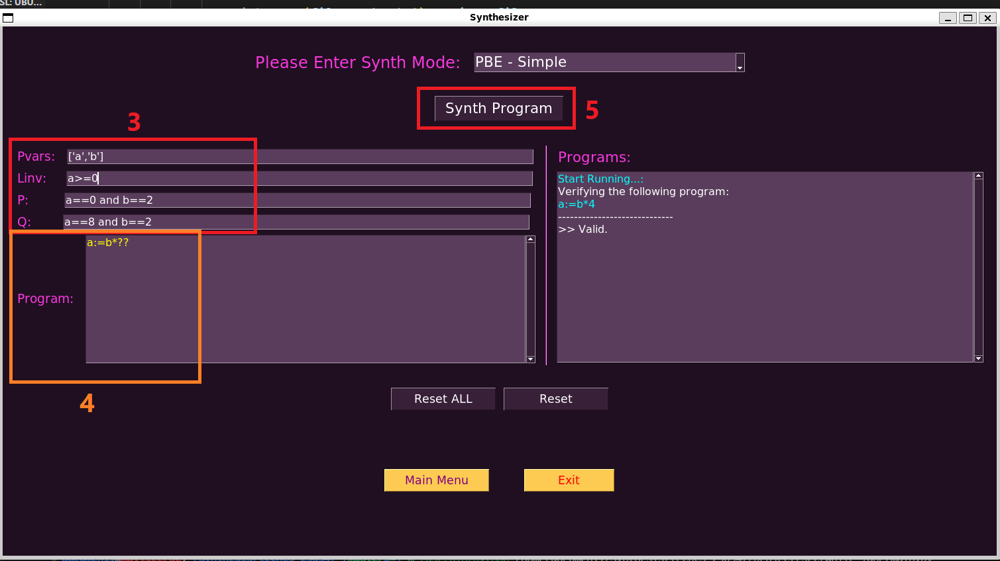

# Program Synthesizer

Our synthesizer can get as User Input in both modes and Synthesize a program based on the input. Our synthesizer sketch support Integers and Strings.

## Synthesizer Modes:
Our synthesizer operates in four primary modes:
- Run through examples: which allows the user to learn and test the synthesizer abilities, by going over a set of preconstructed, diverse and comprehensive examples.
- User input: allows the user to utillize the full potential of the synthesizer, and write his own program with matching constraints , and recieve the synthesized code.

## Synthesizer Ability:
- PBE: In this mode, our synthesizer generates Python programs based on provided input-output examples.

- ASSERT Mode: In this mode, our synthesizer can handle simple assertions in programs.

*simple Mode: runs through examples of PBE and ASSERT that are simple assign.

## Synthesizer Limits:
- 
-
-
- 
## Usage

#### Run Through Examples mode:
1. Click on the "Run Through Examples" button in the main menu.
2. choose the constraints type on the upper checkbox (PBE or ASSERT).
3. Click the "GO" button to start viewing the examples.
4. Click "Next Example" to continue to the next example program

#### Usert Input mode:
1. Click on the "Usert Input" button in the main menu.
2. choose the constraints type on the upper checkbox (PBE or ASSERT).
3. Insert the needed constraints in the same format seen in the examples.
4. Insert wanted program to complete, with the sketch hold in a place suitable for the given Synth abilities metioned above.
5. Click the "Synth Program" button to get the fully completed code. Click on "Resert" or "Reset ALL" to change tour input.

** The convention of inputs:
- PVars should be of format: ['S'] where S is a string
- 

## Demo

A demo of the User Input mode:

1. Click on the "Usert Input" button in the main menu.

2. choose the constraints type on the upper checkbox (PBE or ASSERT).

3. Insert the needed constraints in the same format seen in the examples.
4. Insert wanted program to complete, with the sketch hold in a place suitable for the given Synth abilities metioned above.
5. Click the "Synth Program" button to get the fully completed code on the right "Programs" window. Click on "Resert" or "Reset ALL" to change tour input.

