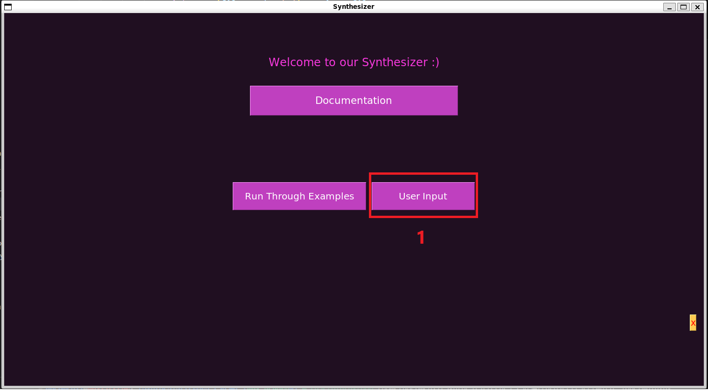
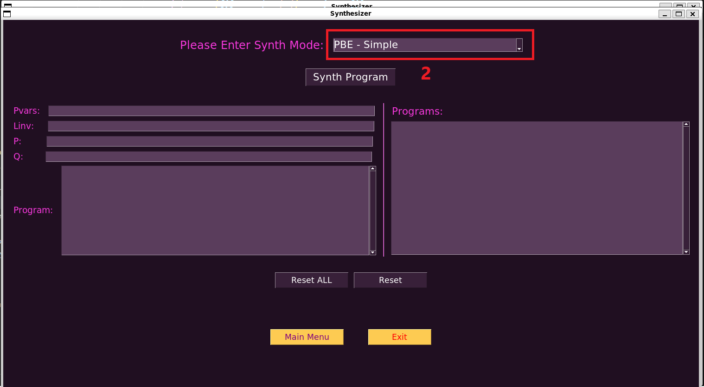
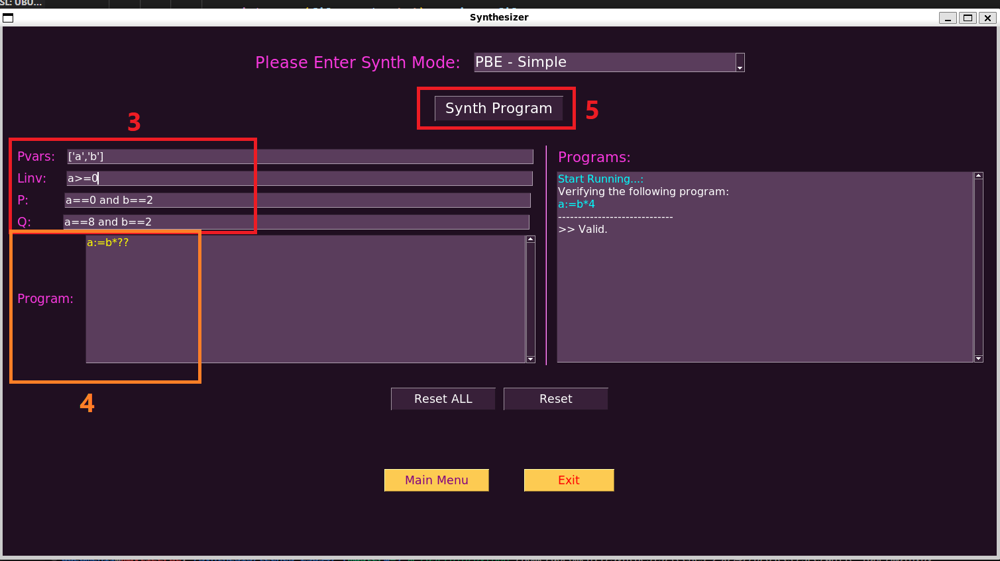

# Program Synthesizer

## Synthesizer Ability:

1. The synthesizer support Features 1 & 2 as requested in the project description.
  
2. We’ve added support the synthesize complicated programs based on the variables, constants and provided operations between them.
  
3. The synthesizer support programs with while statements - includes loops constant unroll (by 4) and ambiguity resolution of loop entering (in PBE mode, in cases of values that could be generated by entering the loop or not we conduct checking which of the cases is more likely).
  
4. We’ve implemented additional support for String types supporting all the above functionalities.
  
5. The synthesizer is wrapped with an GUI for user comfort, with a dedicated section for presenting the tests we use to evaluate our tool, and a feature of dynamicly enter cases and check them.
  
## Synthesizer Modes:

Our synthesizer operates in four primary modes:
- Run through examples: which allows the user to learn and test the synthesizer abilities, by going over a set of preconstructed, diverse and comprehensive examples.
- User input: allows the user to utillize the full potential of the synthesizer, and write his own program with matching constraints , and recieve the synthesized code.

### Examples types:
According to the requested Featurs 1 & 2 are:
 PBE Type: In this type, our synthesizer generates Python programs based on provided input-output examples.
 ASSERT Type: In this type, our synthesizer can handle simple assertions in programs. 
  
We divided the given and premade examples to "Simple" and "Part Of Program" for each type, where Simple runs through examples of PBE and ASSERT that are simple assign, and Part Of Program are more complex examples.

## Synthesizer Limits:
- Cannot hanlde sketch holes inside the while loop.
- Cannot hanlde ASSERT expression inside the while loop. 
- While loop unroll with factor greater than 4.
-
- 

## Usage

#### Run Through Examples mode:
1. Click on the "Run Through Examples" button in the main menu.
2. choose the constraints type on the upper checkbox (PBE or ASSERT).
3. Click the "GO" button to start viewing the examples.
4. Click "Next Example" to continue to the next example program

#### User Input mode:
1. Click on the "Usert Input" button in the main menu.
2. choose the constraints type on the upper checkbox (PBE or ASSERT).
3. Insert the needed constraints in the same format seen in the examples.
4. Insert wanted program to complete, with the sketch hold in a place suitable for the given Synth abilities metioned above.
5. Click the "Synth Program" button to get the fully completed code. Click on "Resert" or "Reset ALL" to change tour input.

** The convention of inputs:
- PVars should be of format: "['S1','S2'....]" where S is a string. i.e. ['a','b','my_variable']
- LINV should be of format: "S1 op constant and S2 op constant" A boolean condition. i.e. a>=0 and b<1
- P should be of format: "S1==constant and S2==constant and..." i.e. S1==0 and S2==45 and my_variable==13
- Q should be of format: Identical to P format.

## Setup
(on a unix based system or WSL enviroment)

python version must be AT LEAST 3.10.*

1. pull the git reposetory of the project using:
```console
git pull https://github.com/shaysegal/techcs-236347/tree/master
```

2. install z3 solver on the enviroment:
```console
pip install z3-solver
```

3. install tkinter on the enviroment:
```console
pip install tk
```
for mac users you might also need to do
```console
brew install python-tk
```

4. install pysimplegui on the enviroment:
```console
pip install pysimplegui
```

*Make sure the examples folder is recognized by the code in the main.py (if not change it to absolute path in lines 16-19).

#### To run the synthisizer, run the main.py file in the repo.

## Demo

A demo of the User Input mode:

1. Click on the "Usert Input" button in the main menu.


2. choose the constraints type on the upper checkbox (PBE or ASSERT).


3. Insert the needed constraints in the same format seen in the examples.
4. Insert wanted program to complete, with the sketch hold in a place suitable for the given Synth abilities metioned above.
5. Click the "Synth Program" button to get the fully completed code on the right "Programs" window. Click on "Resert" or "Reset ALL" to change tour input.

